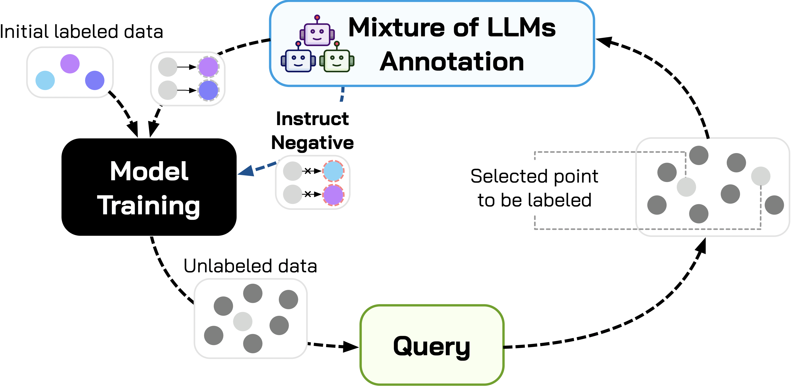

# Next Generation Active Learning: Mixture of LLMs in the Loop (AAAI 2026)

[](https://aaai.org/)

---

## Overview
This repository contains the official implementation accompanying our AAAI 2026 paper. It proposes MoLLIA, an active learning framework that leverages a small panel of instruction-tuned LLMs as noisy annotators and learns a meta-model (MoLAM) to fuse their signals into reliable soft labels for downstream text classification.

Full Paper (PDF): [https://arxiv.org/abs/2601.15773](https://arxiv.org/abs/2601.15773)

Appendix (PDF): [Appx/MoLLIA_appendix.pdf](Appx/MoLLIA_appendix.pdf)


<p align="center">
  
</p>

*Figure 1: An overview of the proposed MoLLIA architecture.*

MoLLIA combines:
- Multiple LLMs’ predicted labels and token-level logits per example
- A meta-learner (XGBoost) that aggregates LLM signals into calibrated class probabilities (MoLAM)
- Pool-based active learning with several query strategies (Random, Max Entropy, CoreSet, Noise Stability, and BEMPS)
- A robust training objective with reweighting and negative learning to mitigate LLM noise


## Quick links
- Notebook for MoLAM: `MoLAM.ipynb`
- Active learning trainers: `trainAL.py` (Random/MaxEntropy/CoreSet/NoiseStability), `trainALC.py` (BEMPS)
- Configs: `conf/{ag_news, imdb, trec, pubmed-20k-rct}.json`
- Datasets/LLM utilities: `setup.py`, `labelGen.py`, `metaLearn.py`
- Query strategies: `queryBaseline.py`, `noise_stability.py`
- Datasets wrappers: `Qdatasets.py`


## Environment setup
We provide a pinned Conda environment.

```bash
# 1) Create and activate the environment
conda env create -f environment.yml
conda activate py39mollia

# 2) (Recommended) Log in to Hugging Face to download the LLM checkpoints
#    Some models require authentication and significant GPU memory
huggingface-cli login  # optional
```

Hardware notes:
- LLMs used by MoLAM (7B–9B) require a modern GPU with >=24 GB VRAM for smooth inference; adjust batch sizes or the number of sampled examples if resources are limited.
- PyTorch builds here target CUDA 12.1; adjust to your system as needed.


## Datasets
Datasets load automatically via `datasets.load_dataset` in `setup.py`:
- AG News (`fancyzhx/ag_news`)
- IMDb (`stanfordnlp/imdb`)
- TREC (`CogComp/trec`)
- PubMed 20k RCT (`pietrolesci/pubmed-20k-rct`)

Train/val/test splits follow `setup.get_exp_dataset(...)` with a fixed random seed for reproducibility on AG News/IMDb/TREC and predefined split for PubMed.


## LLMs used for MoLAM
Configured in `setup.get_llm_model` (bfloat16, device map):
- `google/gemma-2-9b-it`
- `meta-llama/Llama-3.1-8B-Instruct`
- `mistralai/Mistral-7B-Instruct-v0.3`
- `Qwen/Qwen2.5-Coder-7B-Instruct`
- `01-ai/Yi-1.5-9B-Chat`

We query each LLM multiple times per input to capture agreement and uncertainty, and also derive simple label-aligned logits from the last-token distribution (`labelGen.get_llm_logit`).

## Pipeline overview
MoLLIA runs in two stages: (A) train MoLAM to fuse LLM signals; (B) active learning with the fused labels.

### A. Train the meta-learner (MoLAM)
Use `MoLAM.ipynb` to complete the following steps per dataset:
1) Training data generation
   - Sample up to 10k training texts and query each LLM 10× per text.
   - Save raw JSONL to `output_exp/molam_train_raw_data/{dataset}_{llm}.json` with fields: `label`, `llm_logits`, `llm_label`, `text`.
2) Formalization (meta-features)
   - For each example and each LLM, concatenate (i) LLM logits over labels and (ii) majority-vote distribution over 10 generations.
   - Save features/targets to `output_exp/molam_train_data/{dataset}_meta_{x,y}.npy`.
3) Train MoLAM (XGBoost)
   - Iterative pseudo-labeling over meta-features; best model saved to `output_exp/molam_model/molam_{dataset}.json`.
4) Demo evaluation
   - Quick in-sample sanity check on the meta-features.

Tip: The formalization cell expects raw files under `output_exp/molam_train_raw_data/`. Ensure the path used in the notebook matches your files.

Fast start (recommended): You can skip steps (1)–(3) and use our pre-trained MoLAM models stored in `output_exp/molam_model/`. This is convenient and avoids the LLM querying cost.

Example: load a pre-trained model
```python
import xgboost as xgb

def load_molam(dataset):
  model = xgb.XGBRegressor()
  model.load_model(f"output_exp/molam_model/molam_{dataset}.json")
  return model

molam = load_molam("ag_news")
```

### B. Train the active learning classifier
Two trainers are provided:
- `trainAL.py`: Random | Max Entropy | CoreSet | NoiseStability
- `trainALC.py`: BEMPS

Common CLI arguments:
- `--conf`: path to the dataset config under `conf/`
- `--output_dir`: directory to write logs, checkpoints, plots, and JSON outputs
- `--al_model`: `Bert` or `RoBERTa` (DistilBERT/DistilRoBERTa backbones)
- `--dataset`: one of `ag_news`, `imdb`, `trec`, `pubmed-20k-rct`
- `--num_al`: number of active learning rounds (default 12)
- `--num_epochs`: epochs per AL round (default 40)
- `--n_train`: run index for repeated trials
- `--sampling`: query strategy; see below
- `--n_annote`: newly annotated items per AL round (default 50)
- `--n`, `--temp`, `--prob`: LLM query count and generation hyperparameters used when obtaining labels

Example (AG News, CoreSet):
```bash
python trainAL.py \
  --conf conf/ag_news.json \
  --output_dir output_exp/mollia_output/ag_news_RoBERTa_CoreSet/ \
  --al_model RoBERTa \
  --dataset ag_news \
  --num_al 12 \
  --num_epochs 40 \
  --n_train 1 \
  --sampling CoreSet \
  --n_annote 50 \
  --n 10 --temp 0.7 --prob 0.9
```

Example (AG News, BEMPS):
```bash
python trainALC.py \
  --conf conf/ag_news.json \
  --output_dir output_exp/mollia_output/ag_news_Bert_bemps/ \
  --al_model Bert \
  --dataset ag_news \
  --num_al 12 \
  --num_epochs 40 \
  --n_train 1 \
  --sampling bemps \
  --n_annote 50 \
  --n 10 --temp 0.7 --prob 0.9
```

Convenience shell scripts are provided under `scipts/` (e.g., `trainAL.sh`, `trainALC.sh`). Adjust dataset/model/strategy and run.


### Learning objective: discrepancy-aware weighting + negative learning
During AL classifier training (see `trainAL.py` and `trainALC.py`), we apply two mechanisms to improve robustness under noisy LLM supervision:

- Discrepancy-aware reweighting (annotation discrepancy):
  - Compare the AL classifier’s hard prediction (argmax of its probabilities) with the MoLAM/LLM-derived label for the newly added samples each round.
  - If they disagree, reduce the sample’s weight (e.g., to 0.5) in the cross-entropy term, softening the influence of potentially noisy annotations.
  - Implementation hints: construction of `al_weights` from the mismatch between `al_probs_label` and `llm_label`.

- Negative learning with implicit negatives from MoLAM:
  - Derive a set of negative labels per sample from MoLAM logits (averaged across LLMs) by thresholding very low-confidence classes.
  - Add a negative learning loss that penalizes the classifier for placing probability mass on these negatives; the penalty increases across AL rounds.
  - Implementation hints: `negative_learning_loss(...)` and `negative_labels` built from low MoLAM logits.

Together, these strategies stabilize training when LLM-generated labels are noisy or inconsistent.


## Outputs
- Active learning runs: under your `--output_dir`, including
  - Checkpoints: `${output_dir}/checkpoint/`
  - Training info and sampled indices: `${output_dir}/trainINFO/`, `${output_dir}/sampleLS.json`
  - Validation/test curves: `${output_dir}/*.png`
  - Per-round probabilities and summaries: `${output_dir}/probs/`, `${output_dir}/results.json`
- Meta data (for MoLAM): `output_exp/molam_train_data/{dataset}_meta_{x,y}.npy`
- MoLAM models: `output_exp/molam_model/molam_{dataset}.json`


## Citation
If you find this repository useful, please cite our AAAI 2026 paper:

```bibtex
@inproceedings{qiyuanyuan2026mollia,
  title     = {Next Generation Active Learning: Mixture of LLMs in the Loop},
  author    = {Qi, Yuanyuan and Yang, Xiaohao and Lu, Jueqing and Guo, Guoxiang and Enticott, Joanne and Gang, Liu and Du, Lan},
  booktitle = {Proceedings of the AAAI Conference on Artificial Intelligence},
  year      = {2026}
}
```


## Acknowledgments
We thank the open-source community behind Hugging Face Transformers and Datasets, and the authors of the backbones and LLMs used in this work.


